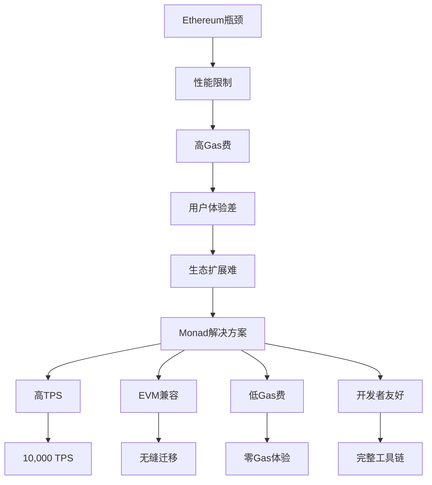

# Monad Labs获2.25亿美元融资：打造EVM兼容区块链新标杆

## 区块链技术革新者Monad Labs完成战略融资

2024年4月9日，区块链开发公司Monad Labs宣布成功完成2.25亿美元融资，本轮融资由知名风投机构Paradigm领投。这笔资金将加速推进其高性能Ethereum虚拟机（EVM）兼容区块链的研发进程，为去中心化金融（DeFi）领域带来革命性技术突破。

### 融资亮点与战略布局
- **资金规模**：2.25亿美元战略融资
- **领投机构**：Paradigm（区块链领域顶级投资机构）
- **参与投资方**：Electric Capital、Castle Island Ventures、Animoca Ventures、Coinbase Ventures、CoinFund
- **核心用途**：扩充技术团队、推进主网测试、完善生态建设

👉 [了解区块链投资新机遇](https://bit.ly/okx_welcome)

### 技术突破：EVM兼容性与性能跃升
Monad Labs开发的Layer 1区块链完全兼容Ethereum虚拟机（EVM），这意味着：
- 可直接部署现有DeFi协议
- 开发者无需重构智能合约
- 用户操作体验无缝迁移

通过重构区块链底层架构，团队实现了三大技术革新：
1. **并行执行机制**：突破传统区块链串行处理瓶颈
2. **协议层优化**：提升各层级数据处理效率
3. **共识算法升级**：保障高吞吐量下的网络安全性

### 性能对比：DeFi基础设施的代际跨越

| 指标          | Ethereum主网 | Monad测试网 |
|---------------|--------------|-------------|
| TPS（吞吐量） | 15-45        | 10,000      |
| 出块时间      | 12-14秒      | 1秒         |
| EVM兼容性     | 原生支持     | 完全兼容    |
| 开发者工具链  | 成熟生态     | 增强版工具集|

👉 [探索高性能区块链生态](https://bit.ly/okx_welcome)

### DeFi生态重构：万亿市场的技术基石
当前DeFi市场总锁仓量（TVL）超过450亿美元，但Ethereum网络拥堵和高昂Gas费严重制约行业发展。Monad Labs的解决方案具有革命性意义：
- **开发者友好**：现有项目可无缝迁移
- **用户体验优化**：秒级确认+零Gas费体验
- **生态扩展性**：支持大规模商业级应用

### 行业竞争格局分析
区块链性能竞赛进入新阶段：
- **同类项目对比**：
  - Solana：65,000 TPS（非EVM兼容）
  - Avalanche：4,500 TPS（EVM兼容）
  - Monad：10,000 TPS（完全EVM兼容）

👉 [把握区块链技术投资先机](https://bit.ly/okx_welcome)

### 未来路线图
1. **2024Q2**：启动主网压力测试
2. **2024Q3**：开放开发者测试网
3. **2024Q4**：首批DeFi协议部署
4. **2025**：实现跨链资产互通

### 投资方战略考量
Paradigm合伙人表示："Monad在保持EVM兼容性的前提下实现性能突破，这是解决DeFi可扩展性的关键路径。"其他参投机构则看重其技术团队背景（核心成员来自Google、Meta等科技巨头）和清晰的商业化路径。

### 常见问题解答

**Q：为什么选择EVM兼容路线？**
A：这确保了现有DeFi生态的快速迁移，避免重复建设。目前96%的DeFi协议基于EVM，兼容性是生态扩展的核心。

**Q：如何平衡速度与安全性？**
A：通过创新的共识机制设计，在提升TPS的同时保持拜占庭容错特性。测试网运行三个月零故障验证了技术可靠性。

**Q：与Layer 2方案有何区别？**
A：作为原生Layer 1解决方案，无需依赖二层网络即可实现高性能，同时保持与Ethereum的安全互通。

**Q：资金使用规划？**
A：60%用于技术研发，20%投入生态建设，15%用于市场推广，5%作为战略储备金。

**Q：何时可商用？**
A：测试网已运行三个月，主网预计2024年底上线，首批合作伙伴包括多个头部DeFi协议。

### 技术演进路线

### 行业影响预测
根据DeFi市场研究机构数据，Monad技术可能带来：
- 交易成本降低98%
- 用户日活提升300%
- DeFi TVL年增长率提高至120%
- 开发者数量增长5倍

### 技术白皮书核心摘要
- **共识机制**：改进型PoS（权益证明）
- **存储结构**：分层状态树优化
- **网络层**：异步消息传递协议
- **智能合约**：EVM 2.0兼容层

### 开发者生态建设
目前已启动三大计划：
1. **开发者激励计划**：提供百万美元资助
2. **工具链升级**：推出可视化部署平台
3. **测试网奖励**：首批部署项目奖励200万美元

### 市场前景展望
随着以太坊坎昆升级推进，Layer 2生态快速发展，Monad的技术突破为区块链基础设施发展提供了新思路。据预测，到2025年，高性能EVM兼容链将占据DeFi市场30%份额，创造超过1500亿美元的经济价值。

👉 [把握区块链技术投资窗口期](https://bit.ly/okx_welcome)