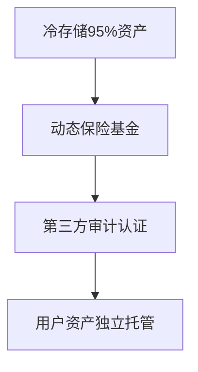

# 交易所价格战：行业现状与未来趋势分析

## 行业格局演变：从野蛮生长到精细化竞争

近年来，加密货币交易所行业经历了剧烈洗牌。**头部平台凭借技术优势与合规化运营占据主导地位**，而中小交易所则在持续的价格战中面临生存压力。据行业数据显示，全球Top5交易所已占据超过60%的市场份额，这种马太效应在2021年监管政策收紧后尤为明显。

👉 [选择合规交易平台](https://bit.ly/okx_welcome)

### 大型交易所优势凸显，小型平台面临生存压力
在熊市周期中，头部交易所展现出更强的抗风险能力。以Coinbase、Binance为代表的头部平台，通过以下策略巩固市场地位：
- 建立做市商激励机制提升流动性
- 开发衍生品等高附加值服务
- 投资安全基础设施获得多重合规认证
反观小型交易所，由于用户基础薄弱，在手续费收入持续下降的情况下，难以覆盖运维成本。英国Coinfloor交易所的停运案例，正是行业洗牌的典型缩影。

### 监管趋严倒逼行业规范化发展
纽约司法部长办公室2022年发布的《虚拟市场诚信倡议》报告揭示了行业深层问题：
| 监管重点       | 风险表现                 |
|----------------|--------------------------|
| 市场操纵       | 虚假交易量、价格操控     |
| 利益冲突       | 内部交易、优先执行       |
| 客户资产安全   | 冷热钱包分离、保险覆盖   |

👉 [了解平台合规保障](https://bit.ly/okx_welcome)

韩国在2021年实施的《特定金融交易信息法》具有标志性意义。该法规要求所有交易所必须：
1. 通过金融情报机构（FIU）认证
2. 实施银行级实名制账户管理
3. 建立反洗钱（AML）监控系统
这项政策直接导致35家不合规平台退出市场，推动行业向持牌化方向发展。

## 技术创新：下一代交易所的五大核心要素

面对激烈竞争，领先的交易所正在构建差异化优势。根据行业研究，成功平台需具备以下功能模块：

1. **智能撮合引擎**：实现每秒百万级订单处理能力
2. **跨链交易协议**：支持BTC/ETH/TRON等主流公链资产直接兑换
3. **风险控制系统**：包含实时异常交易监测、熔断机制等模块
4. **去中心化架构**：采用分布式服务器集群应对高并发访问
5. **多语言服务体系**：覆盖全球主要市场本地化需求

新加坡某头部交易所的案例显示，其通过部署AI驱动的做市商系统，将交易对价差缩小了40%，有效提升了用户留存率。

## 安全威胁：交易所面临的持续挑战

### 黑客攻击手段升级
2021年Liquid交易所被黑事件暴露了行业安全漏洞。据Elliptic的追踪分析，攻击者采用新型**跨链重放攻击**技术，绕过传统防御体系。该事件造成的9700万美元损失，促使交易所加速部署以下防护措施：
- 零知识证明（ZKP）技术应用
- 多签钱包升级为阈值签名方案（TSS）
- 建立链上行为分析预警系统

### 用户资产保护机制
领先平台已建立三层保障体系：

## 未来发展趋势研判

### 监管科技（RegTech）应用深化
香港实施的虚拟资产服务提供商发牌制度，标志着行业进入**合规即竞争力**的新阶段。合规成本的上升将加速中小平台出清，预计到2025年全球持牌交易所数量将缩减至200家以内。

### 交易技术创新方向
值得关注的三大技术演进：
1. **混合型交易所**：融合CEX与DEX优势的交易架构
2. **社交化交易**：引入跟单交易、策略分享社区功能
3. **智能路由系统**：自动比较多个交易所的最优成交价格

👉 [体验智能交易系统](https://bit.ly/okx_welcome)

## 常见问题解答

**Q：交易所价格战对普通用户有何影响？**
A：短期可享受更低手续费，但需警惕平台因资金链问题突然停运。建议选择日均交易量排名前10的合规平台。

**Q：如何判断交易所是否安全？**
A：可通过以下指标评估：
- 是否获得ISO/IEC 27001认证
- 冷钱包资金占比是否高于90%
- 是否公开透明披露安全审计报告

**Q：监管政策收紧会带来哪些变化？**
A：将推动行业向合规化、专业化发展，具体表现为：
- 用户身份认证（KYC）流程更严格
- 交易品种需通过合规审查
- 建立用户资金保险赔偿机制

**Q：新手选择交易所需注意哪些要素？**
A：建议重点考察：
- 支持的交易对种类
- 提现手续费结构
- 客户服务响应速度
- 移动端应用体验

**Q：未来交易所将如何提升竞争力？**
A：头部平台正在布局：
- Web3.0基础设施建设
- 开发NFT交易专区
- 提供质押挖矿服务
- 构建开发者生态

**Q：加密货币交易所会消失吗？**
A：短期来看，交易所仍是市场核心基础设施。但随着分布式金融（DeFi）发展，未来可能形成"中心化交易所+去中心化协议"的双轨体系。
