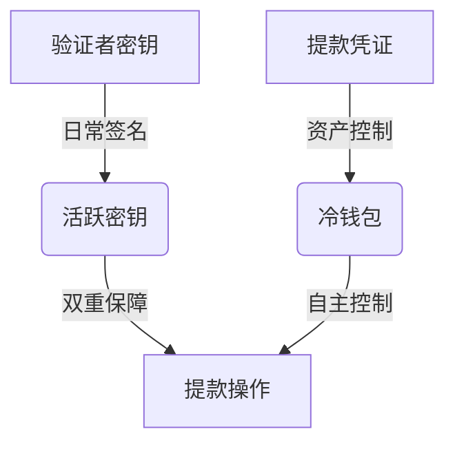

# 以太坊Pectra升级：深度解析ETH质押与网络效率革新

## 升级核心看点

以太坊即将于2025年5月7日启动的**Pectra升级**，标志着区块链技术发展的重要里程碑。此次升级将通过11项EIP提案实现三大核心突破：  
1. **验证者余额上限提升64倍**（EIP-7251）  
2. **质押激活时间缩短98%**（EIP-6110）  
3. **提款机制双重保障升级**（EIP-7002）  

👉 [深入了解以太坊质押策略](https://bit.ly/okx_welcome)

## 核心升级方案解析

### EIP-7251：验证者余额上限革命

#### 技术突破
将验证者有效余额上限从**32 ETH**提升至**2048 ETH**，在保持最低质押门槛不变的前提下实现：  
| 指标                | 升级前       | 升级后         | 提升幅度 |
|---------------------|-------------|---------------|---------|
| 单验证者最大余额     | 32 ETH      | 2048 ETH      | 64倍    |
| 质押收益复利效率     | 手动操作     | 自动复利       | 100%自动化 |
| 节点运营成本         | 100%        | 降至15-20%    | 80%↓    |

#### 行业影响
- **机构投资者**：单节点质押规模扩大带来**年化收益提升3-5%**  
- **散户用户**：支持40/80/128 ETH等灵活质押方案  
- **网络性能**：验证者数量预计减少**60-70%**，降低信标链内存占用40%  

> "云计算成本将大幅下降，这对大规模质押机构而言是革命性突破"  
> —— Alluvial首席SRE工程师David Turnbull  

### EIP-6110：极速激活机制

#### 技术演进
通过将质押激活流程**完全链上化**，实现：  
- 激活时间：**12小时→13分钟**  
- 激活成功率：从92%提升至99.9%  
- 网络吞吐量：支持**每日新增10万验证者**  

#### 应用场景
- **流动性质押**：用户质押后可立即获得衍生品凭证  
- **市场响应**：在ETH质押收益率波动时，节点可快速进出市场  

### EIP-7002：双重提款权限

#### 安全机制升级
引入**双密钥独立提款**机制：  

#### 用户价值
- **风险隔离**：热钱包故障时仍可安全提款  
- **收益管理**：支持**部分提款**功能，灵活提取收益  
- **机构方案**：质押服务商可构建**零信任托管体系**  

## 升级影响全景图

### 质押生态变革
| 维度          | 传统模式               | Pectra升级后             |
|---------------|-----------------------|--------------------------|
| 质押门槛      | 固定32 ETH            | 灵活32-2048 ETH          |
| 收益复利      | 人工操作               | 智能合约自动执行          |
| 提款控制      | 单密钥风险             | 双密钥冗余保障           |
| 节点管理      | 每节点32 ETH           | 单节点最高2048 ETH        |
| 网络负载      | 每验证者1.2MB内存      | 内存占用降低至0.3MB      |

### 行业应用场景
1. **DeFi整合**：质押ETH可直接参与借贷协议  
2. **机构服务**：推出分级收益产品（优先/劣后份额）  
3. **零售方案**：自动复利产品+动态收益分配  

## 常见问题解答

**Q：普通用户如何参与Pectra升级？**  
A：无需主动操作，钱包余额超过32 ETH即可享受自动复利功能。建议启用双密钥管理提升安全性。

**Q：升级期间ETH价格会波动吗？**  
A：历史数据显示重大升级前3个月通常有5-8%溢价，但需注意短期市场波动风险。

**Q：如何选择质押服务商？**  
A：重点关注三点：  
1. 是否支持EIP-7002双提款机制  
2. 自动复利手续费率（建议≤5%）  
3. 节点分布地域多样性  

**Q：升级会影响以太坊交易费用吗？**  
A：基础费用（Base Fee）不受影响，但网络扩容将使L2交易成本进一步降低30-40%。

👉 [探索ETH质押收益计算器](https://bit.ly/okx_welcome)

## 未来展望

Pectra升级为以太坊奠定三大技术基石：  
1. **账户抽象化**（EIP-7702）：钱包智能化开启  
2. **数据分片**（EIP-7691）：Layer2成本再降40%  
3. **Verkle树**：状态存储需求减少80%  

> "这次升级相当于给以太坊安装涡轮引擎，2025年ETH质押收益率有望突破6%"  
> —— ConsenSys研究总监  

## 行动指南

1. **钱包升级**：确保使用支持EIP-7251的客户端（如Lighthouse v4.0+）  